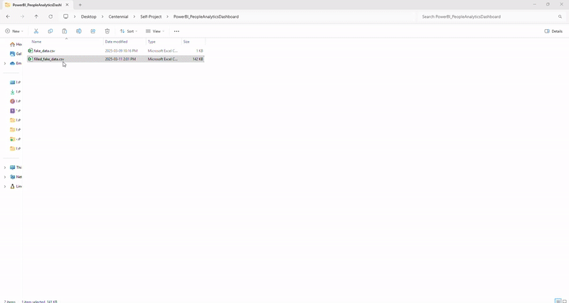
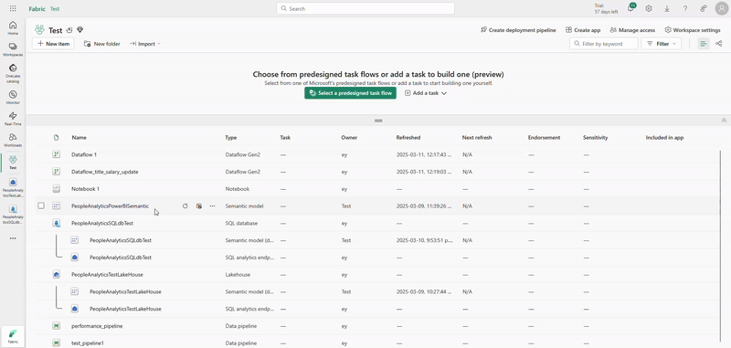
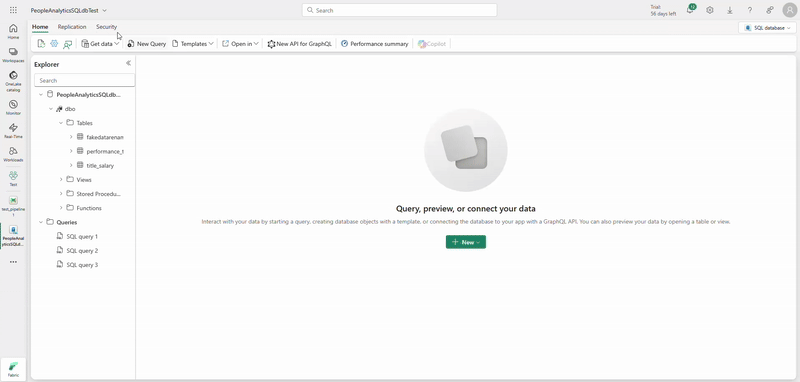
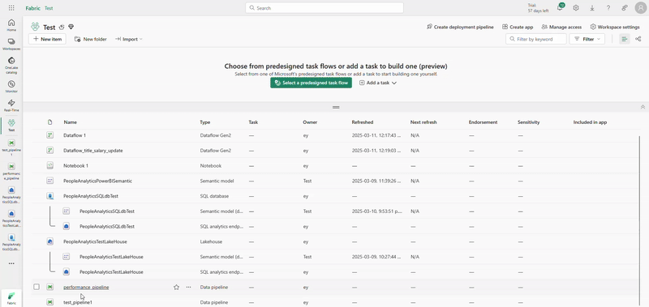

# Introduction

This project contains only synthetic data and does not relate to any real person or company.  
The purpose of this project is to test and showcase the basic functionality of **Microsoft Fabric (Azure Data Factory)** and **Power BI**. A data professional explored these tools over a span of **4-5 hours** to demonstrate their capabilities.  

Since the data was generated using AI, the figures may not always align logically.

---

## **1. Generating Synthetic Data**

Initially, a synthetic dataset was created in **CSV format** using AI for an **imaginary company** with **1,000 employees**, including both current and former employees.  

The dataset includes columns such as:
- **Employee ID**
- **Employee Name**
- **Function**
- **Department**
- **Additional employee information**  

---

## **2. Creating a Data Lake**

Next, the generated `.csv` file was used to create a **data lake** in **Microsoft Fabric**. The data lake serves as a **centralized data repository** for the organization.  

> 📌 **Note:** In this example, only a single file is stored in the data lake. This file will later be used to create a database.

---

## **3. Creating a Database with Three Tables**

The data file was then imported into a **database** as a table. Additionally, **two more tables** were created to simulate a **real-world business scenario**.

> **Scenario:**  
> In this imaginary company, **employees’ performance scores and salary data** for certain departments and titles should **not** be visible to all HR employees.  
>  
> To comply with this policy, sensitive information is merged into the **main table** via a **data pipeline**, creating a **new restricted table** for specific use.

---

## **4. Implementing the Data Pipeline**

In the **data pipeline**, the following transformations were applied:  

1️⃣ **Merging performance data** with the main table using **Employee ID** as the key.  
2️⃣ **Adding salary information**, but only for specific **functions** and **titles** where necessary.  

---

## **5. Building the Power BI Dashboard**

### **Page 1: Company Overview**

Once the **data transformation** was completed, the dataset was imported into **Power BI** to create a **People Analytics Dashboard**.

The **first page** provides a **company overview**, including:
- **Total number of employees**
- **Employee distribution across functions**  

🔹 Users can filter the report **by job title** using the slicer on the right-hand side.

---

### **Page 2: Exit Reasons & Performance Analysis**

The **second page** of the dashboard focuses on **employee exits**, analyzing:  
- **Exit reasons**  
- **Average performance scores of exited employees**  

📌 The **'Drill Through' function** allows users to explore **detailed information** on exited employees.

---

## **Conclusion**
This project demonstrates the **end-to-end workflow** of using **Microsoft Fabric (Azure Data Factory)** and **Power BI** for **data ingestion, transformation, and visualization**.  

Would love to hear your feedback! 🚀  
